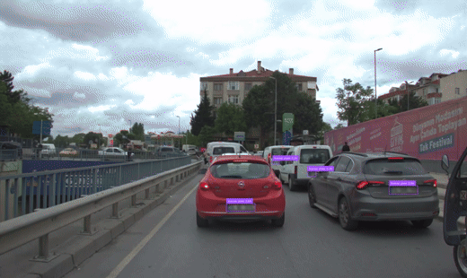

## autoware_rosbag2_anonymizer

### Introduction

A tool to anonymize images in ros2 bags. The tool combines GroundingDINO, OpenCLIP, SegmentAnything2 and YOLO to anonymize images in rosbags

<p align="center">
    
</p>

- [autoware\_rosbag2\_anonymizer](#autoware_rosbag2_anonymizer)
  - [Introduction](#introduction)
  - [Installation](#installation)
    - [Clone the repository](#clone-the-repository)
    - [Download the pretrained weights](#download-the-pretrained-weights)
    - [Install ros2 mcap dependencies if you will use mcap files](#install-ros2-mcap-dependencies-if-you-will-use-mcap-files)
    - [Install `autoware_rosbag2_anonymizer` package](#install-autoware_rosbag2_anonymizer-package)
  - [Usage](#usage)
    - [Anonymize with Unified Model](#anonymize-with-unified-model)
    - [Train Your Own YOLO Model](#train-your-own-yolo-model)
    - [Validate the Tool](#validate-the-tool)
  - [Configuration](#configuration)
    - [`config/anonymize_with_unified_model.yaml`](#configanonymize_with_unified_modelyaml)
    - [`config/yolo_create_dataset.yaml`](#configyolo_create_datasetyaml)
    - [`config/yolo_train.yaml`](#configyolo_trainyaml)
    - [`config/yolo_anonymize.yaml`](#configyolo_anonymizeyaml)
    - [`config/validation.yaml`](#configvalidationyaml)
  - [Troubleshooting](#troubleshooting)
  - [Citation](#citation)

---

### Installation

#### Clone the repository

``` shell
git clone https://github.com/autowarefoundation/autoware_rosbag2_anonymizer.git
cd autoware_rosbag2_anonymizer
```

#### Download the pretrained weights

``` shell
wget https://dl.fbaipublicfiles.com/segment_anything_2/092824/sam2.1_hiera_small.pt

wget https://huggingface.co/ShilongLiu/GroundingDINO/resolve/main/GroundingDINO_SwinB.cfg.py
wget https://huggingface.co/ShilongLiu/GroundingDINO/resolve/main/groundingdino_swinb_cogcoor.pth

wget https://github.com/autowarefoundation/autoware_rosbag2_anonymizer/releases/download/v1.0.0/yolo11x_anonymizer.pt
wget https://github.com/autowarefoundation/autoware_rosbag2_anonymizer/releases/download/v1.0.0/yolo_config.yaml
```

#### Install ros2 mcap dependencies if you will use mcap files

``` shell
sudo apt install ros-humble-rosbag2-storage-mcap
```

#### Install `autoware_rosbag2_anonymizer` package

Before installing the tool, you should update the pip package manager.

```bash
python3 -m pip install pip -U
```

``` shell
python3 -m pip install .
```

### Usage

The tool provides two options to anonymize images in rosbags. You can directly anonymize your
ROS2 bag file with option 1 or you can train your own YOLO model with option 2 to improve the results.

- If your ROS 2 bag file includes custom message types from Autoware or any other packages, you should source the their workspaces before running the tool.
  - `source /path/to/your/workspace/install/setup.bash`

#### Anonymize with Unified Model

You should provide the path to the forlder which contains ROS 2 bag files and the output folder to save anonymized bag files. The model is a combination of GroundingDINO, OpenCLIP, YOLO and
SegmentAnything anonymize images in rosbags. If you don't want to use pre-trained YOLO model,
you can follow the instructions in the second option to train your own YOLO model.

You should set your configuration in `config/anonymize_with_unified_model.yaml` file.

``` shell
python3 main.py config/anonymize_with_unified_model.yaml --anonymize_with_unified_model
```

#### Train Your Own YOLO Model

To improve the results, you can train your own YOLO model with the dataset created by the unified model.

Check the documentation to see the detailed instructions. [Train Your Own YOLO Model](docs/train-your-own-yolo-model.md)

#### Validate the Tool

You can validate the tool with YOLO format dataset. Validation process will calculate precision, recall and mAP scores for the dataset.

You should set your configuration in `config/validation.yaml` file.

``` shell
python3 main.py config/validation.yaml --validation
```

Code will output the precision, recall and mAP scores for the dataset. Also it will save the results in the `validation_results.txt` folder.

For detailed information about the validation process, you can check the [Validation Documentation](docs/validation.md).

### Configuration

Define prompts in the `validation.json` file. The tool will use these prompts to detect objects.
You can add your prompts as dictionaries under the `prompts` key. Each dictionary should have two keys:
- `prompt`: The prompt that will be used to detect the object. This prompt will be blurred in the anonymization process.
- `should_inside`: This is a list of prompts that object should be inside. If the object is not inside the prompts, the tool will not blur the object.

``` json
{
    "prompts": [
        {
            "prompt": "license plate",
            "should_inside": ["car", "bus", "..."]
        },
        {
            "prompt": "human face",
            "should_inside": ["person", "human body", "..."]
        }
    ]
}
```

You should set your configuration in the configuration files under `config` folder according to the usage.
Following instructions will guide you to set each configuration file.

#### `config/anonymize_with_unified_model.yaml`

```yaml
rosbag:
  input_bags_folder: "/path/to/input_bag_folder" # Path to the input folder which contains ROS 2 bag files
  output_bags_folder: "/path/to/output_folder" # Path to the output ROS 2 bag folder
  output_save_compressed_image: True # Save images as compressed images (True or False)
  output_storage_id: "sqlite3" # Storage id for the output bag file (`sqlite3` or `mcap`)

grounding_dino:
  box_threshold: 0.1 # Threshold for the bounding box (float)
  text_threshold: 0.1 # Threshold for the text (float)
  nms_threshold: 0.1 # Threshold for the non-maximum suppression (float)

open_clip:
  score_threshold: 0.7 # Validity threshold for the OpenCLIP model (float

yolo:
  confidence: 0.15 # Confidence threshold for the YOLO model (float)

bbox_validation:
  iou_threshold: 0.9 # Threshold for the intersection over union (float), if the intersection over union is greater than this threshold, the object will be selected as inside the validation prompt

blur:
  kernel_size: 31 # Kernel size for the Gaussian blur (int)
  sigma_x: 11 # Sigma x for the Gaussian blur (int)
```

#### `config/yolo_create_dataset.yaml`

```yaml
rosbag:
  input_bags_folder: "/path/to/input_bag_folder" # Path to the input ROS 2 bag files folder

dataset:
  output_dataset_folder: "/path/to/output/dataset" # Path to the output dataset folder
  output_dataset_subsample_coefficient: 25 # Subsample coefficient for the dataset (int)

grounding_dino:
  box_threshold: 0.1 # Threshold for the bounding box (float)
  text_threshold: 0.1 # Threshold for the text (float)
  nms_threshold: 0.1 # Threshold for the non-maximum suppression (float)

open_clip:
  score_threshold: 0.7 # Validity threshold for the OpenCLIP model (float

bbox_validation:
  iou_threshold: 0.9 # Threshold for the intersection over union (float), if the intersection over union is greater than this threshold, the object will be selected as inside the validation prompt
```

#### `config/yolo_train.yaml`

```yaml
dataset:
  input_dataset_yaml: "path/to/data.yaml" # Path to the config file of the dataset, which is created in the previous step

yolo:
  epochs: 100 # Number of epochs for the YOLO model (int)
  model: 'yolo11x.pt' # Select the base model for YOLO ('yolo11x.pt' 'yolo11l.pt', 'yolo11m.pt', 'yolo11s.pt', 'yolo11n.pt)
```

#### `config/yolo_anonymize.yaml`

```yaml
rosbag:
  input_bag_path: "/path/to/input_bag/bag.mcap" # Path to the input ROS 2 bag file with 'mcap' or 'sqlite3' extension
  output_bag_path: "/path/to/output_bag_file" # Path to the output ROS 2 bag folder
  output_save_compressed_image: True # Save images as compressed images (True or False)
  output_storage_id: "sqlite3" # Storage id for the output bag file (`sqlite3` or `mcap`)

yolo:
  model: "path/to/yolo/model" # Path to the trained YOLO model file (`.pt` extension) (you can download the pre-trained model from releases)
  config_path: "path/to/input/data.yaml" # Path to the config file of the dataset, which is created in the previous step
  confidence: 0.15 # Confidence threshold for the YOLO model (float)

blur:
  kernel_size: 31 # Kernel size for the Gaussian blur (int)
  sigma_x: 11 # Sigma x for the Gaussian blur (int)
```

#### `config/validation.yaml`

```yaml
dataset:
  input_dataset_yaml: "path/to/data.yaml" # Path to the config file of the dataset, which is created in the previous step
  max_samples: -1 # Maximum number of samples to use for validation (int), if -1, all samples will be used

  grounding_dino:
  box_threshold: 0.1 # Threshold for the bounding box (float)
  text_threshold: 0.1 # Threshold for the text (float)
  nms_threshold: 0.1 # Threshold for the non-maximum suppression (float)

open_clip:
  score_threshold: 0.7 # Validity threshold for the OpenCLIP model (float

bbox_validation:
  iou_threshold: 0.9 # Threshold for the intersection over union (float), if the intersection over union is greater than this threshold, the object will be selected as inside the validation prompt
```

### Troubleshooting

<details>
  <summary><b>Error 1: <code>torch.OutOfMemoryError: CUDA out of memory</code></b></summary>

  ```bash
  torch.OutOfMemoryError: CUDA out of memory. Tried to allocate 1024.00 MiB. GPU 0 has a total capacity of 10.87 GiB of which 1010.88 MiB is free. Including non-PyTorch memory, this process has 8.66 GiB memory in use. Of the allocated memory 8.21 GiB is allocated by PyTorch, and 266.44 MiB is reserved by PyTorch but unallocated. If reserved but unallocated memory is large try setting PYTORCH_CUDA_ALLOC_CONF=expandable_segments:True to avoid fragmentation. 
  See documentation for Memory Management (https://pytorch.org/docs/stable/notes/cuda.html#environment-variables)
  ```

  This error occurs when the GPU memory is not enough to run the model. You can add the following environment variable to avoid this error.

  ```bash
  export PYTORCH_CUDA_ALLOC_CONF=expandable_segments:True
  ```
</details>
<details>
  <summary><b>Error 2: Tool is taking too much time to process</b></summary>

  The tool might take a significant amount of time to process images, due to the computational complexity of combining multiple models (GroundingDINO, OpenCLIP, YOLO, SegmentAnything).
</details>

### Citation

```bibtex
@article{liu2023grounding,
  title={Grounding dino: Marrying dino with grounded pre-training for open-set object detection},
  author={Liu, Shilong and Zeng, Zhaoyang and Ren, Tianhe and Li, Feng and Zhang, Hao and Yang, Jie and Li, Chunyuan and Yang, Jianwei and Su, Hang and Zhu, Jun and others},
  journal={arXiv preprint arXiv:2303.05499},
  year={2023}
}
```

```bibtex
@article{kirillov2023segany,
  title={Segment Anything},
  author={Kirillov, Alexander and Mintun, Eric and Ravi, Nikhila and Mao, Hanzi and Rolland, Chloe and Gustafson, Laura and Xiao, Tete and Whitehead, Spencer and Berg, Alexander C. and Lo, Wan-Yen and Doll{\'a}r, Piotr and Girshick, Ross},
  journal={arXiv:2304.02643},
  year={2023}
}
```

```bibtex
@software{ilharco_gabriel_2021_5143773,
  author       = {Ilharco, Gabriel and
                  Wortsman, Mitchell and
                  Wightman, Ross and
                  Gordon, Cade and
                  Carlini, Nicholas and
                  Taori, Rohan and
                  Dave, Achal and
                  Shankar, Vaishaal and
                  Namkoong, Hongseok and
                  Miller, John and
                  Hajishirzi, Hannaneh and
                  Farhadi, Ali and
                  Schmidt, Ludwig},
  title        = {OpenCLIP},
  month        = jul,
  year         = 2021,
  note         = {If you use this software, please cite it as below.},
  publisher    = {Zenodo},
  version      = {0.1},
  doi          = {10.5281/zenodo.5143773},
  url          = {https://doi.org/10.5281/zenodo.5143773}
}
```